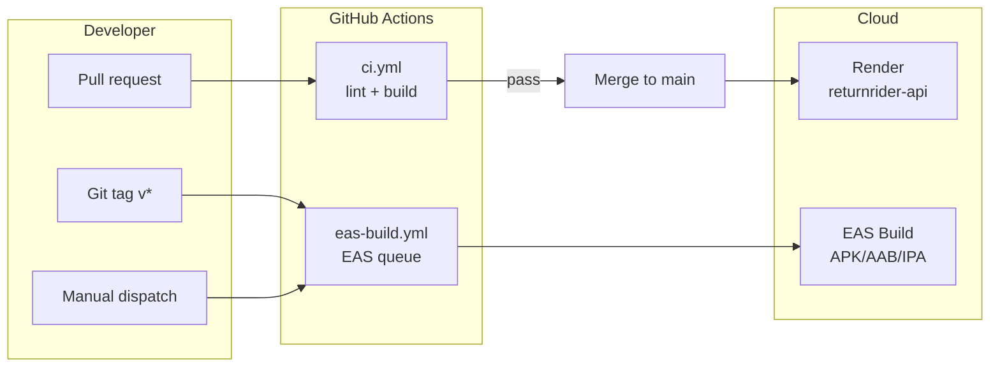

# ReturnRider CI/CD

End-to-end automation for the monorepo: **API** (NestJS on Render), **mobile** (Expo EAS Build), and future **store submit** / **OTA updates**.

**Account:** `ahmed5145` · **EAS project:** `@ahmed5145/returnrider` (`bb385e3a-8199-4ff2-a65a-6f6a4826983a`)

---

## Executive summary

| Layer | Tool | When it runs | Cost |
|-------|------|--------------|------|
| PR checks | GitHub Actions | Every PR + push to `main` | Free (GitHub) |
| API staging/prod | Render Blueprint | Auto on `main` push (after GitHub connect) | Render free tier |
| Android/iOS builds | EAS Build | **Manual** + **release tags** only | EAS free quota (see below) |
| App store submit | EAS Submit | Manual / tag (later) | Included in build credits on paid plans |

**Do not** trigger an EAS build on every PR or every `main` push on the free plan — you only get **15 Android + 15 iOS builds per calendar month**, and each build waits in the **low-priority queue** (often 15–90+ minutes).

---

## EAS free tier limits (ahmed5145)

Source: [Expo pricing](https://expo.dev/pricing) · [Billing FAQ](https://docs.expo.dev/billing/faq/) (verify before budgeting).

| Limit | Free plan |
|-------|-----------|
| Android builds / month | **15** |
| iOS builds / month | **15** |
| Queue | **Low priority** (“Free Tier Queue”) — waits behind paid users |
| Concurrent builds | **1** at a time |
| Build timeout | **45 minutes** |
| EAS Workflows (CI/CD minutes) | **60 min / month** |
| EAS Update MAUs | 1,000 |
| Billing period reset | **1st of each calendar month** |

**What you saw on the dashboard** (“waiting for concurrency”, “waiting for available worker”) is normal on the free tier. The build is not stuck — it is queued. Paid **Starter ($19/mo)** adds high-priority queue + $45 build credit.

**CI recommendation:** Use `eas build --no-wait` in GitHub Actions so the workflow finishes in ~2 minutes and the build continues on Expo’s servers. Check status at [expo.dev builds](https://expo.dev/accounts/ahmed5145/projects/returnrider/builds).

**Failed builds:** Builds that fail within ~3 minutes may not count against quota (up to 10 waived/month per Expo docs).

---

## Architecture



---

## Repository layout (CI-related)

```
.github/workflows/
  ci.yml              # PR + main: API build, mobile typecheck
  eas-build.yml       # Manual + tags: queue EAS build (non-blocking)

apps/api/             # NestJS — Render rootDir
apps/mobile/          # Expo — EAS working directory
render.yaml           # Render Blueprint
apps/mobile/eas.json  # development | preview | production profiles
```

---

## Phase 0 — Prerequisites (one-time)

### 1. GitHub repository

Push `ReturnRider` to GitHub (private is fine). Enable Actions in repo settings.

### 2. GitHub secrets

| Secret | Used by | How to get |
|--------|---------|------------|
| `EXPO_TOKEN` | `eas-build.yml` | [expo.dev](https://expo.dev) → Account → Access tokens → **Robot user** or personal token with build scope |

API secrets stay on **Render** (not GitHub), unless you add a migration job later.

### 3. Render ↔ GitHub

1. [Render Dashboard](https://dashboard.render.com) → **New** → **Blueprint** → connect repo.
2. Use root `render.yaml` (service `returnrider-api`, `rootDir: apps/api`).
3. Set sync:false secrets: `DATABASE_URL`, `REDIS_URL`, `ENCRYPTION_MASTER_KEY`, `GOOGLE_CLIENT_ID`, `GOOGLE_CLIENT_SECRET`.
4. Enable **Auto-Deploy** on `main` (default for Blueprint).

Staging URL example: `https://returnrider-api.onrender.com` — see [STAGING_DEPLOY.md](./STAGING_DEPLOY.md).

### 4. EAS credentials (already started)

- Android keystore: generated on first `eas build` (stored on Expo servers).
- iOS: requires Apple Developer ($99) — defer until enrolled.

### 5. Google OAuth for CI builds

Redirect URI (Expo Go / auth proxy):

```
https://auth.expo.io/@ahmed5145/returnrider
```

For **development client** APKs, add the custom scheme redirect from `app.json` when you move off Expo Go.

---

## Phase 1 — PR CI (implemented)

**Workflow:** `.github/workflows/ci.yml`

| Job | Steps |
|-----|--------|
| `api` | `npm ci` (workspace root) → `prisma generate` → `nest build` in `apps/api` |
| `mobile` | `npm ci` in `apps/mobile` → `npx tsc --noEmit` |

**Triggers:** `pull_request` and `push` to `main`, with path filters so unrelated edits skip jobs.

**Not in scope yet:** API unit tests (no `*.spec.ts` today), ESLint, mobile Jest.

---

## Phase 2 — EAS build from CI (implemented)

**Workflow:** `.github/workflows/eas-build.yml`

| Trigger | Profile | Platform | Notes |
|---------|---------|----------|-------|
| `workflow_dispatch` | choice: development / preview / production | android / ios / all | Primary day-to-day trigger |
| `push` tags `v*.*.*` | production | android | Release builds only |

**Command pattern:**

```bash
cd apps/mobile
npx eas-cli build --profile "$PROFILE" --platform "$PLATFORM" --non-interactive --no-wait
```

`--no-wait` returns immediately; the build stays in Expo’s queue (same as local `eas build`).

**Monthly budget (solo dev, free tier):**

| Use case | Builds / month | Suggested trigger |
|----------|----------------|-------------------|
| Dev client APK | 2–4 | Manual dispatch, `development` |
| Internal preview | 1–2 | Manual, `preview` |
| Play Store release | 1–2 | Tag `v1.0.1` |
| **Reserve** | ~8 | Buffer for retries |

---

## Phase 3 — API deploy hardening (recommended next)

| Task | Why |
|------|-----|
| Add `GET /health` to CI smoke curl after Render deploy | Catch bad deploys (optional Render deploy hook) |
| Neon migrations in CI or Render `preDeployCommand` | Schema drift — today migrations are manual SQL files in `db/migrations/` |
| Staging + production Render services | `main` → staging; tags → prod (second Blueprint service) |
| `CORS_ORIGINS` env on prod | Lock down before public launch |

**Render free tier note:** Web service spins down after ~15 min idle; first request after sleep is slow (~30–60 s). Fine for staging, not for production users.

---

## Phase 4 — Mobile release train (after smoke test)

| Step | Tool | When |
|------|------|------|
| OTA JS fixes | `eas update` | Hotfixes without native rebuild |
| Play internal testing | `eas submit` + Play Console | After `production` AAB |
| TestFlight | `eas submit` + Apple Dev | After Apple enrollment |
| Version bumps | `eas.json` `production.autoIncrement` | Already enabled |

Add workflow `eas-submit.yml` (manual only) when Play/App Store accounts are ready.

---

## Phase 5 — Quality gates (when team grows)

- API: Jest + supertest on critical paths (`returns`, `auth`, parsers).
- Mobile: Maestro or Detox smoke on preview build.
- Required status checks on `main`: `api` + `mobile` jobs.
- Dependabot for npm workspaces.
- Sentry / Expo crash reporting in `production` profile.

---

## Environment matrix

| Environment | API URL | Mobile build | OAuth |
|-------------|---------|--------------|-------|
| Local | `http://LAN:3000/api/v1` | Expo Go | `auth.expo.io/@ahmed5145/returnrider` |
| Staging | `https://returnrider-api.onrender.com/api/v1` | Dev client APK | Same + dev scheme |
| Production | TBD custom domain | Play / App Store | Production client IDs |

**EAS environment variables:** Configure in [expo.dev project settings](https://expo.dev/accounts/ahmed5145/projects/returnrider/environment-variables) per `development` / `preview` / `production` — e.g. `EXPO_PUBLIC_API_URL` for staging vs prod builds.

---

## Secrets checklist

### GitHub (Actions)

- [ ] `EXPO_TOKEN`

### Render (`returnrider-api`)

- [ ] `DATABASE_URL` (Neon)
- [ ] `REDIS_URL` (Upstash)
- [ ] `JWT_SECRET` (auto or manual)
- [ ] `ENCRYPTION_MASTER_KEY`
- [ ] `GOOGLE_CLIENT_ID` / `GOOGLE_CLIENT_SECRET`
- [ ] Optional: `PLAID_*`, `FCM_*`

### Local only (never commit)

- `apps/api/.env`
- `apps/mobile/.env`

---

## Operator runbook

### Queue a dev Android build from laptop

```cmd
cd apps\mobile
npx eas-cli build --profile development --platform android
```

### Queue same build from CI

GitHub → **Actions** → **EAS Build** → **Run workflow** → profile `development`, platform `android`.

### Check build status

https://expo.dev/accounts/ahmed5145/projects/returnrider/builds

### After APK succeeds

1. Download APK from build page (or install via internal distribution link).
2. `npm run start:dev-client` in `apps/mobile`.
3. Point `EXPO_PUBLIC_API_URL` at staging or LAN.

### Release cut

```bash
git tag v1.0.0
git push origin v1.0.0
# eas-build.yml queues production Android build (non-blocking)
```

---

## Cost upgrade triggers

| Symptom | Action |
|---------|--------|
| Builds wait > 1 hour regularly | Starter plan ($19/mo) — priority queue |
| > 15 Android builds/month | Starter usage-based credits or build less often |
| Render cold starts hurt testers | Paid Render instance or Fly.io |
| Need 2 parallel Android + iOS builds | Production plan ($199/mo) — 2 concurrency |

---

## Related docs

- [EAS_SETUP.md](./EAS_SETUP.md) — account, project ID, first build
- [DEV_BUILD.md](./DEV_BUILD.md) — dev client + push testing
- [STAGING_DEPLOY.md](./STAGING_DEPLOY.md) — Render + Neon
- [GOOGLE_OAUTH_SETUP.md](./GOOGLE_OAUTH_SETUP.md) — redirect URIs

---

## Implementation status

| Item | Status |
|------|--------|
| `docs/CI_CD.md` (this file) | Done |
| `.github/workflows/ci.yml` | Done |
| `.github/workflows/eas-build.yml` | Done |
| Render Blueprint deploy | Config ready — connect GitHub when repo is pushed |
| `EXPO_TOKEN` in GitHub | **You** — one-time setup |
| API tests in CI | Not started |
| `eas submit` workflow | Phase 4 |
