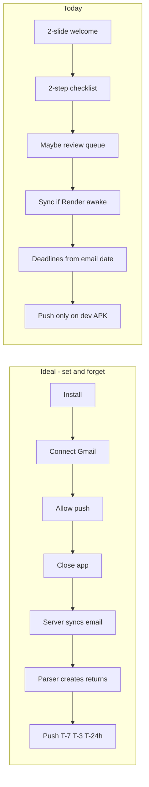

# ReturnRider — North-star audit & roadmap

> **Created:** 2026-06-09  
> **Product in one sentence:** User downloads the app, forgets about it; the app runs in the background, detects online purchases, and sends reminders.  
> **Related:** [BLUEPRINT.md](./BLUEPRINT.md) · [PARSER_TUNING.md](./PARSER_TUNING.md) · [ROADMAP_PHASE4.md](./ROADMAP_PHASE4.md) · [DEV_BUILD.md](./DEV_BUILD.md)

---

## North-star scorecard

| Step | Ideal | Today | Gap |
|------|--------|--------|-----|
| Download & connect | Gmail OAuth once | ✅ Works (Expo Go + staging) | OAuth in **Testing** mode; verification needed for public users |
| Forget about app | No ongoing chores | ⚠️ Partial | Review queue, manual flows, and optional features pull users back in |
| Background detection | Automatic, timely | ⚠️ Partial | Server polls Gmail every **15 min**; Render **free tier sleeps** |
| Reminders | Push before deadline | ⚠️ Built but fragile | **No push in Expo Go (iOS)**; needs dev/production build; timezone scheduling ✅ (Sprint A) |

**Verdict:** Server-side Gmail ingest + BullMQ push scheduling match the vision. **Deadline accuracy**, **push delivery**, and **onboarding friction** still break true “set and forget.”

---

## Ideal vs current flow

---

## Core functional — working well

| Feature | Status | Notes |
|---------|--------|-------|
| Gmail OAuth + encrypted refresh token | ✅ | `POST /emails/connect` |
| 90 / 180d backfill | ✅ | Toggle at connect |
| Incremental sync (~15 min) | ✅ | `EmailSyncScheduler` — when server is awake |
| Commerce filter + parser tuning | ✅ | See [PARSER_TUNING.md](./PARSER_TUNING.md) |
| Order confirm → return + deadline | ✅ | Merchant parsers + intent scoring |
| Multi-inbox | ✅ | Settings → connected emails |
| Snooze + reschedule reminders | ✅ | Return detail + dashboard swipe |
| Tap push → return detail | ✅ | Root layout notification listener |
| Manual add + receipt scan | ✅ | Backup paths — not required for north star |
| Staging API + Neon + Plaid sandbox | ✅ | `/health` feature flags |

---

## P0 — Core gaps (blocks “forget about app”)

### 1. Wrong return deadlines on backfill — ✅ fixed (Sprint A)

**Problem:** Parsers set `orderDate = new Date()` (sync time). Gmail message `internalDate` is not used.

**Impact:** A 60-day-old order synced today gets “30 days left” instead of correct/expired. Reminders fire at wrong times.

**Fix:**
- Read `internalDate` in `email-sync.service.ts` → `processMessage` / `fetchAndParseMessage`
- Pass email date into `parseReceipt` input and all parsers for `orderDate` / `returnDeadlineAt`

**Files:** `apps/api/src/emails/email-sync.service.ts`, `apps/api/src/parsers/types.ts`, merchant parsers

---

### 2. Push reminders not available on iPhone + Expo Go

**Problem:** Push stack exists (BullMQ → Expo Push API) but Expo Go cannot receive remote push (SDK 53+). iOS production needs Apple Developer ($99) + dev/TestFlight build.

**Impact:** Core “forget about app” loop fails without Android dev APK or paid Apple path.

**Fix:**
- Build Android dev APK — [DEV_BUILD.md](./DEV_BUILD.md)
- Test `POST /users/test-push` and real T-7/T-3 jobs on device
- iOS when Apple Developer account ready

**Files:** `apps/mobile/lib/notifications.ts`, `apps/api/src/notifications/push.service.ts`

---

### 3. Notification time not in user’s timezone — ✅ fixed (Sprint A)

**Problem:** `User.timezone` exists (default `America/New_York`) but scheduler uses `setHours(9,0,0,0)` on server `Date` without TZ conversion.

**Impact:** “9am reminder” may land at wrong local time.

**Fix:**
- Capture device timezone on mobile → `PATCH /users/me` or push-token registration
- Use `luxon` or `date-fns-tz` in `notification-scheduler.service.ts` for 9:00 / 10:00 local

**Files:** `apps/api/src/notifications/notification-scheduler.service.ts`, `apps/api/prisma/schema.prisma` (timezone already on User)

---

### 4. Review queue breaks autonomy — ✅ improved (Sprint A)

**Problem:** Low-confidence parses → `parse_review_queue`. Dashboard banner requires user to review.

**Impact:** User must open app and tap — opposite of set-and-forget.

**Options (pick one strategy):**

| Strategy | Behavior |
|----------|----------|
| **Aggressive** | Auto-create for known merchants only; queue generic/unknown |
| **Passive** | Auto-dismiss review items after N days; no banner unless user opens Settings |
| **Hybrid (recommended)** | Auto-create order confirms from top merchants; queue only generic + unknown senders |

**Files:** `apps/api/src/emails/email-sync.service.ts`, `apps/mobile/app/(tabs)/index.tsx`

---

### 5. Render free tier sleeps — ✅ mitigated (Sprint B)

**Problem:** API + BullMQ stop when Render spins down. Sync and delayed push jobs slip until wake.

**Impact:** “Runs in background” only while server is awake.

**Fix:**
- Upgrade Render to **Starter** (always-on), or
- External cron ping `GET /health` every 10 minutes (e.g. cron-job.org, UptimeRobot)

**Files:** [STAGING_DEPLOY.md](./STAGING_DEPLOY.md), `render.yaml`

---

### 6. Onboarding heavier than product needs

**Problem:** 4-slide carousel → 4-step checklist (Gmail, scan, push, Plaid) → dashboard.

**Minimum for north star:**
1. Connect Gmail  
2. Enable push (on supported build)  
3. Done  

**Fix:**
- Shorten welcome to 1–2 screens or skippable
- Checklist: Gmail + push only; move Plaid to Settings “optional”
- Remove review links from onboarding (done in recent pass — keep)

**Files:** `apps/mobile/app/welcome.tsx`, `apps/mobile/app/onboarding/checklist.tsx`

---

### 7. Polling only (no Gmail push to server)

**Problem:** Sync every 15 min, not Gmail `watch` / Pub/Sub.

**Impact:** New emails lag up to 15+ min (+ cold start). Acceptable for T-7/T-3/T-24h reminders; not for instant detection.

**Fix (Sprint C):** Gmail `users.watch` + webhook endpoint, or reduce interval to 5 min for connected users.

---

## P1 — Reliability & ops

| Gap | Why it matters | Fix |
|-----|----------------|-----|
| No user-visible sync health | User thinks app works; inbox silently failed | Settings: last sync time + last error (partially exists) — add warning banner on dashboard |
| `parse_feedback` not used | Same parse mistakes repeat | Merchant blocklist from `not_a_return` feedback |
| Go `email-worker` not deployed | Nest handles sync today | OK for now; document or remove from blueprint |
| `ALLOW_DEV_AUTH=true` on staging | Security risk in production | Disable before public launch |
| Analytics console-only | Can’t measure funnel / retention | Wire PostHog or Amplitude (hooks exist in mobile) |
| No E2E sync → push test | Regressions in core loop | CI job or manual smoke script |
| Parser tests only | API/integration untested | Expand `parsers.test.ts`; add sync fixture tests |

---

## Supplemental features — optimize or defer

Not required for the one-liner. Reduces focus if prioritized before core loop.

| Feature | Status | Recommendation |
|---------|--------|----------------|
| Plaid refund radar | Built | **Hide** from onboarding; Settings optional |
| Apple / Google Wallet | Stub + docs | **Defer** — certs + Apple $99 |
| Referrals / campaigns / share | Built | **Defer** until core loop proven |
| Completed tab / money hero | Built | **Keep** — low cost when user opens app |
| Theme / swipe snooze | Built | **Keep** — polish |
| Export / delete account | Built | **Keep** — trust |
| Parse review UI | Built | **Tune** (P0 #4) |
| EasyPost tracking | Partial | **Defer** — not purchase detection |
| Marketing site / press kit | Docs | **Defer** until launch |
| 4-slide trust carousel | Built | **Shorten** to 1–2 screens |

---

## Notification spec (reference)

From blueprint — implemented in `notification-scheduler.service.ts`:

| Trigger | When | Channel |
|---------|------|---------|
| RET_T7 | T-7 days @ 09:00 local | Push |
| RET_T3 | T-3 days @ 09:00 local | Push |
| RET_T24H | T-24h @ 09:00 local | Push |
| RET_T6H | T-6h | Push |
| RET_OVERDUE | T+1 day @ 10:00 local | Push |

Delivery: Expo Push API (`push.service.ts`). Requires valid `expoPushToken` on user.

---

## Implementation plan

### Sprint A — Correct deadlines (no store accounts)

**Goal:** Accurate reminders even on 90d backfill.

| # | Task | Owner / files |
|---|------|----------------|
| A1 | Gmail `internalDate` → `orderDate` in sync + parsers | `email-sync.service.ts`, parsers |
| A2 | Schedule pushes in `user.timezone` | `notification-scheduler.service.ts`, mobile timezone capture |
| A3 | Slim onboarding: Gmail + push → dashboard | `welcome.tsx`, `checklist.tsx` |
| A4 | Review queue hybrid: auto-create top merchants, queue generic only | `email-sync.service.ts`, threshold rules |
| A5 | Document + test: parser fixtures with dated emails | `parsers.test.ts` |

**Exit criteria:** Backfilled order shows correct days remaining; reminder jobs scheduled at sane local times.

---

### Sprint B — Reminders actually fire

**Goal:** Push works on a real device without opening the app daily.

| # | Task | Owner / files |
|---|------|----------------|
| B1 | Android dev/production APK | [DEV_BUILD.md](./DEV_BUILD.md), EAS |
| B2 | End-to-end: sync → return → test push → scheduled job | Manual smoke checklist below |
| B3 | Render always-on or cron keep-warm | Render dashboard / `render.yaml` |
| B4 | Dashboard sync health warning if `last_error` or stale `last_sync_at` | `index.tsx`, `settings.tsx` |

**Exit criteria:** User receives test push and at least one scheduled reminder on Android dev build.

---

### Sprint C — True set-and-forget + launch prep

**Goal:** Production-ready for strangers.

| # | Task | Doc |
|---|------|-----|
| C1 | Gmail `watch` or 5-min sync | New doc section |
| C2 | iOS push + TestFlight | Apple Developer |
| C3 | `parse_feedback` → merchant blocklist | API + parser |
| C4 | Google OAuth verification | [GOOGLE_OAUTH_VERIFICATION.md](./GOOGLE_OAUTH_VERIFICATION.md) |
| C5 | `ALLOW_DEV_AUTH=false`, production JWT | [STAGING_DEPLOY.md](./STAGING_DEPLOY.md) |
| C6 | Play Store internal track | [PLAY_STORE_ASO.md](./PLAY_STORE_ASO.md) |

---

### Defer / hide (until north star proven)

- Plaid production, Wallet production, EasyPost webhooks  
- Referral growth campaigns, press kit, ASO  
- Apple Developer items until budget approved  

---

## Manual smoke checklist (core loop)

Use after each sprint on **Android dev APK** + staging API.

- [ ] Fresh install → connect Gmail (test user on OAuth consent screen)
- [ ] Complete slim onboarding → land on dashboard
- [ ] Settings shows last sync & no error
- [ ] Returns appear within one sync cycle (or after manual Sync now)
- [ ] Days remaining plausible for an old email (after Sprint A)
- [ ] Enable push → test push received
- [ ] Create return with deadline tomorrow → verify job in DB / receive T-24h (or lower threshold in dev)
- [ ] Tap notification → opens correct return detail
- [ ] No review banner for known-merchant order confirms (after Sprint A4)

---

## Progress tracker

Update this table as sprints ship.

| Sprint | Item | Status |
|--------|------|--------|
| A | internalDate → deadlines | ✅ |
| A | User timezone scheduling | ✅ |
| A | Slim onboarding | ✅ |
| A | Review queue hybrid | ✅ |
| B | Android APK + push E2E | ⬜ (manual — [DEV_BUILD.md](./DEV_BUILD.md)) |
| B | Render always-on / keep-warm | ✅ ([UptimeRobot](./STAGING_DEPLOY.md) — free; no Render cron) |
| B | Sync health UI | ✅ |
| C | Gmail watch / faster sync | ⬜ |
| C | OAuth verification | ⬜ |
| C | Production hardening | ⬜ |
| — | Parser tuning sprint | ✅ [PARSER_TUNING.md](./PARSER_TUNING.md) |
| — | Phase 3–4 product polish | ✅ [ROADMAP_PHASE4.md](./ROADMAP_PHASE4.md) |

---

## Quick reference — what’s left (one paragraph)

For the **one-liner on iPhone + Expo Go today:** ~**75%** on detection (Gmail + parser + hybrid review), ~**30%** on reminders (push blocked on Expo Go), ~**85%** on accuracy (email-date deadlines + timezone scheduling — Sprint A ✅). **Must-do before “done”:** Sprint B (Android build + push + always-on API). **Can wait:** store accounts, OAuth verification for wide beta, Plaid, Wallet, growth features.

---

## Doc index

| Doc | Purpose |
|-----|---------|
| [NORTH_STAR_AUDIT.md](./NORTH_STAR_AUDIT.md) | This file — product audit & sprint plan |
| [PARSER_TUNING.md](./PARSER_TUNING.md) | Parser false-positive fixes |
| [DEV_BUILD.md](./DEV_BUILD.md) | Android APK for push |
| [STAGING_DEPLOY.md](./STAGING_DEPLOY.md) | Render + env |
| [GOOGLE_OAUTH_VERIFICATION.md](./GOOGLE_OAUTH_VERIFICATION.md) | Public Gmail users |
| [BLUEPRINT.md](./BLUEPRINT.md) | Architecture reference |
